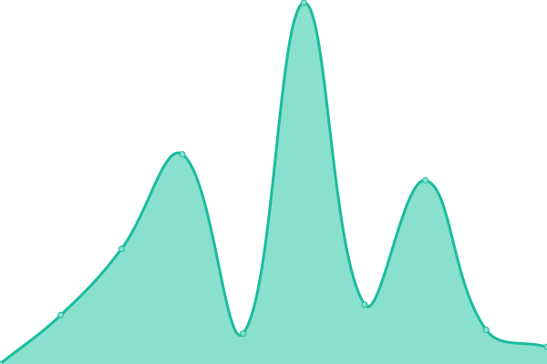

# [📈 Live Status](https://demo.upptime.js.org): <!--live status--> **🟩 All systems operational**

This repository contains the open-source uptime monitor and status page for [Upptime](https://upptime.js.org), powered by [Upptime](https://github.com/upptime/upptime).

With [Upptime](https://upptime.js.org), you can get your own unlimited and free uptime monitor and status page, powered entirely by a GitHub repository. We use [Issues](https://github.com/upptime/upptime/issues) as incident reports, [Actions](https://github.com/gscsre/statuspage/actions) as uptime monitors, and [Pages](https://demo.upptime.js.org) for the status page.

<!--start: status pages-->
<!-- This summary is generated by Upptime (https://github.com/upptime/upptime) -->
<!-- Do not edit this manually, your changes will be overwritten -->
<!-- prettier-ignore -->
| URL | Status | History | Response Time | Uptime |
| --- | ------ | ------- | ------------- | ------ |
|  [San Cristobal](https://www.sancristobal.com.ar/institucional) | 🟩 Up | [san-cristobal.yml](https://github.com/gscsre/statuspage/commits/HEAD/history/san-cristobal.yml) | 

 927ms
     
 | 

<a href="https://gscsre.github.io/statuspage/history/san-cristobal">100.00%</a>
    

|  [Soporte Pas](https://soportepas.sancristobal.com.ar) | 🟩 Up | [soporte-pas.yml](https://github.com/gscsre/statuspage/commits/HEAD/history/soporte-pas.yml) | 

 9002ms
     
 | 

<a href="https://gscsre.github.io/statuspage/history/soporte-pas">100.00%</a>
    

|  [San Cristobal Retiro](https://www.sancristobalretiro.com.ar) | 🟩 Up | [san-cristobal-retiro.yml](https://github.com/gscsre/statuspage/commits/HEAD/history/san-cristobal-retiro.yml) | 

 2909ms
     
 | 

<a href="https://gscsre.github.io/statuspage/history/san-cristobal-retiro">100.00%</a>
    

|  [San Cristobal Caja Mutual](https://www.sancristobalcaja.com.ar) | 🟩 Up | [san-cristobal-caja-mutual.yml](https://github.com/gscsre/statuspage/commits/HEAD/history/san-cristobal-caja-mutual.yml) | 

 3796ms
     
 | 

<a href="https://gscsre.github.io/statuspage/history/san-cristobal-caja-mutual">100.00%</a>
    

|  [San Cristobal Viajes y Turismos](https://www.sancristobalturismo.com.ar/institucional) | 🟩 Up | [san-cristobal-viajes-y-turismos.yml](https://github.com/gscsre/statuspage/commits/HEAD/history/san-cristobal-viajes-y-turismos.yml) | 

 638ms
     
 | 

<a href="https://gscsre.github.io/statuspage/history/san-cristobal-viajes-y-turismos">100.00%</a>
    

|  [San Cristobal Uruguay](https://www.sancristobalseguros.com.uy/institucional) | 🟩 Up | [san-cristobal-uruguay.yml](https://github.com/gscsre/statuspage/commits/HEAD/history/san-cristobal-uruguay.yml) | 

 987ms
     
 | 

<a href="https://gscsre.github.io/statuspage/history/san-cristobal-uruguay">100.00%</a>
    

|  [San Cristóbal Servicios Financieros](https://www.sancristobalsf.com.ar) | 🟩 Up | [san-cristobal-servicios-financieros.yml](https://github.com/gscsre/statuspage/commits/HEAD/history/san-cristobal-servicios-financieros.yml) | 

 961ms
     
 | 

<a href="https://gscsre.github.io/statuspage/history/san-cristobal-servicios-financieros">100.00%</a>
    

|  [Asociart](https://www.asociart.com.ar) | 🟩 Up | [asociart.yml](https://github.com/gscsre/statuspage/commits/HEAD/history/asociart.yml) | 

 735ms
     
 | 

<a href="https://gscsre.github.io/statuspage/history/asociart">100.00%</a>
    

|  [Asociart Servicios](https://www.asociartservicios.com.ar) | 🟩 Up | [asociart-servicios.yml](https://github.com/gscsre/statuspage/commits/HEAD/history/asociart-servicios.yml) | 

 510ms
     
 | 

<a href="https://gscsre.github.io/statuspage/history/asociart-servicios">100.00%</a>
    

<!--end: status pages-->

[**Visit our status website →**](https://demo.upptime.js.org)

## 📄 License

- Powered by: [Upptime](https://github.com/upptime/upptime)
- Code: [MIT](./LICENSE) © [Upptime](https://upptime.js.org)
- Data in the `./history` directory: [Open Database License](https://opendatacommons.org/licenses/odbl/1-0/)
